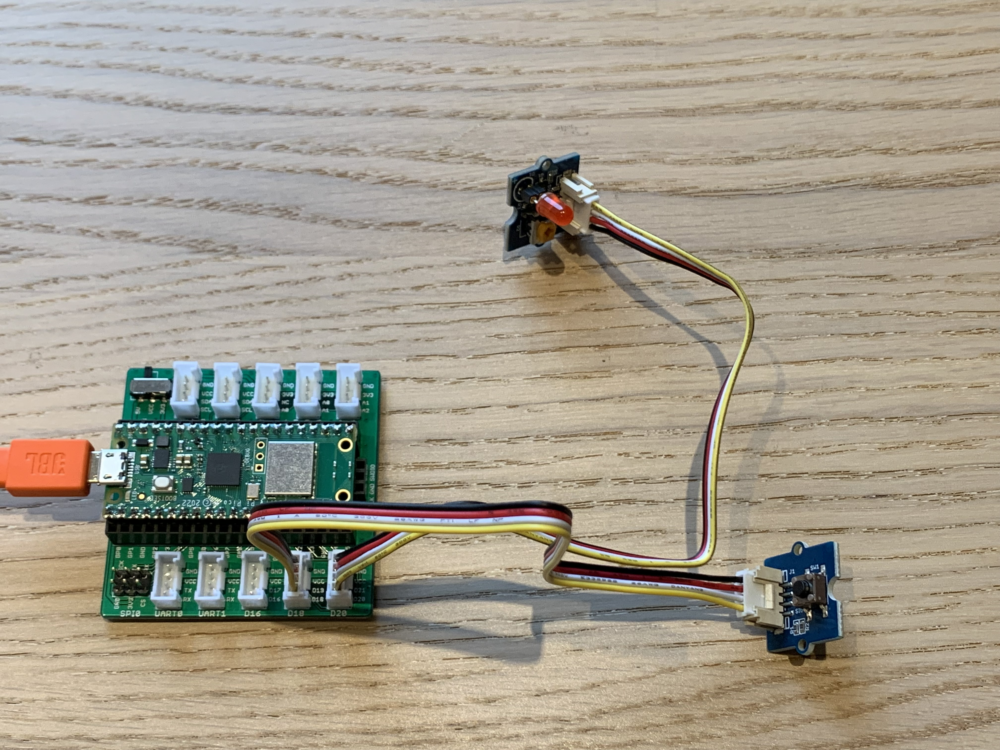

# GPIO

Pour contrôler les GPIO le plus simple est d'utiliser une classe prévu à cette effet. Cette classe est nommé `Pin` et vient du module `machine`, ce module `machine` est intégé à l'interpéteur Micropython. Pour déclarer un objets de cette classe, il faut définir certains paramètres de base. Le seul argument obligatoire de la fonction d'initalisation est `id` pour choisir la pin de la carte utilisée. Dans nos codes nous avons ajouté d'autres paramètres, dont `machine.Pin.OUT` ou `machine.Pin.IN` qui permet de définir le mode de fonctionnement de la pin. Les codes de ce répértoire sont des exemples pour l'utilisation des GPIO.

## button_led.py

Le code [button_led](button_led.py) montre le fonctionnement de la lecture d'un bouton et l'activation d'une led. Ces deux éléments sont des objets réels qui vont être matérialisés dans le programme via l'utilisation de classe. Ces deux objets seront, pour commencer, instantanisé puis leurs fonctions internes permettront de les commander. La suite du programme est une condition, si le bouton est pressé la led s'allume. Pour ce faire, il faut tester l'état du bouton et activer la led en fonction. La fonction `value()` nous permettra de faire les deux, elle est détailé [ici](https://github.com/hepl-scropetta/smartcities/edit/main/GPIO/README.md#fonction-value).

## interuption.py

Le code [interuption](interuption.py) donne un exemple de comment utiliser une interuption en Micropython. Nous retrouvons les deux objets qui représentent le bouton et la led. Une nouvelle fonction est déclarer `toggle_led()`, qui est un handler pour notre interuption. Un handler est une fonction qui sera appelée lors d'une interuption. Ce handler doit être le plus court et le plus rapide possible, pour garantir le meilleur fonctionnement. Idéalement, il faut ausi que sont temps d'execution doit être prévisible et constant. Ensuite, la fonction `irq()` est appelée pour configurer l'interuption, cette fonction est détailer [ici].(https://github.com/hepl-scropetta/smartcities/edit/main/GPIO/README.md#fonction-irq) Pour finir un boucle infinie est lancé afin de garder le programme en fonctionnement, sinon le microcontrôler quitte le programme et l'interuption est oubliée.

### Fonction `value()`

Cette fonction à deux utilité différentes. Si elle est appelée sans argument alors elle retourne l'état de la Pin qui y est connectée. Par contre, si la fonction est appelé avec un argument booléen (`1` ou `0`), l'état de la pin sera modifiée en fonction de l'argument donnée.

Dans nos codes, nous retrouvons bien les deux manières de l'utiliser ; en lecture avec le bouton et en écriture avec la led.

### Fontion `toggle()`

La fonction `toggle()` est, selon la [documentation](https://docs.micropython.org/en/latest/library/pyb.LED.html), une fonction de la classe `LED`. Cependant, cette fonction est aussi utilisable avec la classe `Pin` et permet d'inverser l'état du sortie.
Je ne connais pas encore assez la construction des classes dans Micropython mais j'auais imaginé que la classe `LED` découlait de la classe `Pin` et non l'inverse.

### Fonction `irq()`

L'acronyme IRQ vient de "interupt request". Cette fonction configure une interuption sur la pin de l'objet `Pin`. Le premier argument est le handler, une fonction qui sera executée lors de l'interuption. D'autres paramètres sont définisable comme le mode le `trigger`, qui défini le type de déclanchement ou le `wake` permet de définir quand l'interuption sera execuer en fonction du mode de consommation du microcontôler. 

Tout les informations de la class `Pin` ainsi que ses fonctions sont disponible dans la [documentation](https://docs.micropython.org/en/latest/library/machine.Pin.html#class-pin-control-i-o-pins)

## Résultats

Les deux premières photos sont le résultat du code [button_led](button_led.py) et les deux dernières sont pour le code [interuption](interuption.py)

<picture>
  
</picture>
<picture>
  
</picture>
<picture>
  
</picture>
<picture>
  
</picture>
